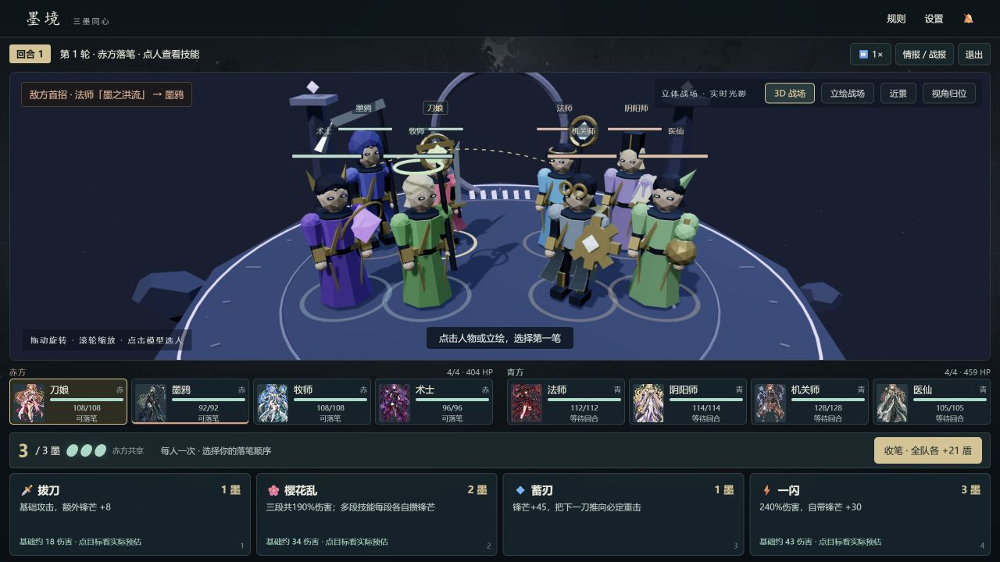

# 墨境之战

东方幻想回合制对战游戏，使用本地 ES modules、Three.js 3D 战场、立绘回退和 Canvas 技能演出。当前产品方向见 [`docs/DIRECTION.md`](docs/DIRECTION.md)，完整工程约定见 [`CLAUDE.md`](CLAUDE.md)。



当前版本：所有模式共用三墨规则、10 套预设与自由编队、单屏 3D 战场。改动与实际验证见 [验收报告](docs/shared-ink-validation.md)。

## 开始游戏

双击桌面「墨境之战.lnk」，或运行：

```bash
node serve-game.mjs
```

然后打开 <http://localhost:5566/inkfight.html>。必须通过 HTTP 访问，不能直接打开 `file://`。页面包含首页、墨路远征、同屏双人、人机、观战、角色档案、战绩室和战斗/结算页。

自由对战是四人队伍、全队每轮共享 3 墨、每名队员每轮至多行动一次。点角色查看技能，点技能后选择目标；余墨在收笔时转成全队护盾。远征在三场战斗之间加入路线、遗物和伤势延续。

战斗默认使用 3D 主体视图，可切换立绘；WebGL 不可用时自动回退。3D 支持点击模型或名字选人、拖动旋转、滚轮缩放、全景/近景和视角归位。角色立绘是保留资产。

## 远征快速开始

首页进入「墨路远征」，选择四人预设或自定义小队，再选开局墨契。每站先看两条路线和敌影，再进入战场；胜利后选择墨契奖励或营地休整。伤势会沿路保留，倒下的队友按远征规则归队。远征存档独立保存，不写入对战战绩。

## 存档与分享

存档在浏览器当前 origin 的 `localStorage` 中。localhost、GitHub Pages 和 `file://` 互不共享；清理浏览器数据会删除本机存档。远征战斗中断从该战起点恢复，单招中途不保证恢复。

对战战绩和好友分享保留旧格式兼容，并以 `legacy` / `ink-v1` 标记规则集；战绩室可分别筛选和统计。分享码的 HMAC 与自洽审计只能防止随手改数字，不是服务器认证。远征结果不混入对战战绩。

## 本地开发

```bash
npm test
npm run balance -- 4000
node tools/expedition-check.mjs 180
```

平衡验证要注明局数、种子、阵容、路线、遗物、AI 噪声和选择策略；未实际运行的数据不写成结论。浏览器验证使用静音状态 `localStorage.inkfight_muted = '1'`，结束后关闭标签页。

规则和实现边界：`src/core`、`src/ai`、`src/data`、`tools` 是可在 Node 导入的纯逻辑；`src/game` 和 `src/view` 负责编排与呈现。`combat.js` 提供基础战斗规则，`ink-turn.js` 提供共享墨行动规则，`skill-executor.js` 由 live/sim/preview 共用，`expedition.js` 管路线与旅程，`record.js` / `share-code.js` 管兼容战绩。不要在多个入口复制同一规则。

Three.js 0.180.0 和许可证在 `vendor/three/`，不访问 CDN。`launch-game.vbs` 必须纯 ASCII；修改后用 `cscript //nologo launch-game.vbs` 检查。辅助软件与下载缓存放在 E 盘，项目仍位于原来的工作目录。
